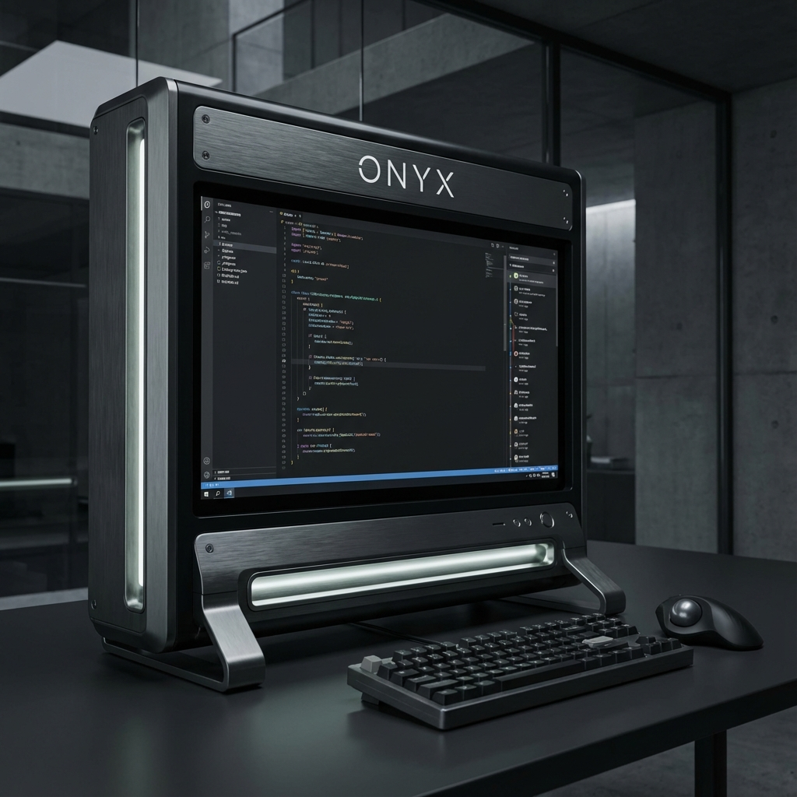

# Onyx Terminal

> **Secure, Industrial-Grade Prompt Engineering Interface**

Onyx is a sophisticated prompt management utility designed for developers and prompt engineers who value precision, version control, and a "cyber-industrial" aesthetic. It transforms the way you draft, test, and manage AI instructions by providing a dedicated terminal environment for prompt iteration.



## ⚡ Key Features

- **Airlock Security**: A custom-built access gateway to ensure your prompt repository remains protected.
- **Time Travel (Versioning)**: A visual scrubber that allows you to instantly jump between different snapshots of your prompts. Never lose a high-performing iteration again.
- **The Obsidian Interface**: A high-contrast, minimalist design language optimized for long-form prompt Engineering sessions.
- **Categorization & Tagging**: Efficiently organize your "Protocols" (prompts) using a robust tagging and categorization system.
- **Direct Commits**: Seamlessly save and decommission prompts with industrial-themed actions.

## 🛠️ Tech Stack

- **Framework**: [Next.js](https://nextjs.org) (App Router)
- **Styling**: Tailwind CSS & Framer Motion (for smooth, glitch-inspired animations)
- **Database**: Drizzle ORM with LibSQL (Local SQLite)
- **Icons**: Lucide React
- **State Management**: Zustand

## 🚀 Getting Started

To get your own Onyx terminal running locally, follow these steps:

### 1. Prerequisites

Ensure you have [Bun](https://bun.sh) (recommended) or Node.js installed.

### 2. Installation

```bash
git clone https://github.com/KhayredineG/onyx.git
cd onyx
bun install
```

### 3. Local Setup

Copy the environment variables and run migrations if necessary (Onyx uses a local SQLite database).

```bash
cp .env.example .env.local
# Onyx automatically handles local DB initialization
```

### 4. Deployment

Run the development server:

```bash
bun dev
```

Open [http://localhost:3000](http://localhost:3000) with your browser to see the result.

## 📁 Project Structure

- `src/app`: Next.js application routes and server actions.
- `src/components`: UI components including the `Editor`, `TimeTravel` scrubber, and `Airlock`.
- `src/lib`: Internal utilities, store (Zustand), and database schema.
- `src/db`: Drizzle configuration and migrations.

---

*Onyx is built for those who treat prompt engineering as a science.*
